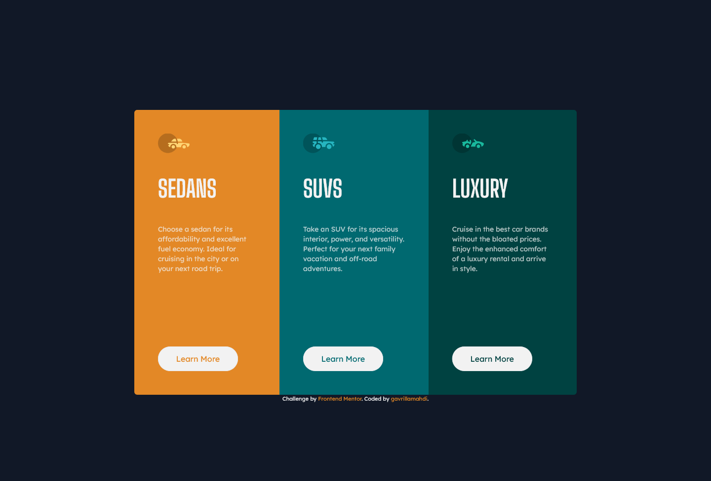

# Frontend Mentor - 3-column preview card component solution

Hello, my name is [gavrillamahdi](https://github.com/gavrillamahdi) and this is my solution to the [3-column preview card component challenge on Frontend Mentor](https://www.frontendmentor.io/challenges/3column-preview-card-component-pH92eAR2-). Frontend Mentor challenges help me improve my coding skills by building realistic projects.

## Table of contents

- [Overview](#overview)
  - [The challenge](#the-challenge)
  - [Screenshot](#screenshot)
  - [Links](#links)
- [My process](#my-process)
  - [Built with](#built-with)
  - [What I learned](#what-i-learned)
- [Author](#author)

## Overview

### The challenge

Users should be able to:

- View the optimal layout depending on their device's screen size
- See hover states for interactive elements

### Screenshot

In this challenge, I did a little bit improvization by changing the background if the user's prefers color scheme is dark.

#### Light mode

##### Desktop (1440px)

##### Mobile (375px)

  

#### Dark mode

##### Desktop (1440px)

##### Mobile (375px)

  

### Links

- Solution URL: [3-column-preview-card-component-main](https://gavrillamahdi.github.io/3-column-preview-card-component-main/)

**Note: you can change the theme to dark by changing your device theme to dark mode**

## My process

### Built with

- Semantic HTML5 markup
- Flexbox
- CSS Grid
- Mobile-first workflow
- [Tailwind CSS](https://tailwindcss.com/) - CSS framework

### What I learned

In this challenge I learn how to use `prefers-color-scheme` CSS media feature to style the website to dark mode when the user's indicate dark preference through an operating system setting. [Tailwind CSS](https://tailwindcss.com/) handle this behaviour through `dark:` classes utilites. This approach pretty easy to use and implement when building a website I think

## Author

- Frontend Mentor - [@gavrillamahdi](https://www.frontendmentor.io/profile/gavrillamahdi)
- Instagram - [@gavrillamahdi](https://www.instagram.com/gavrillamahdi/)
